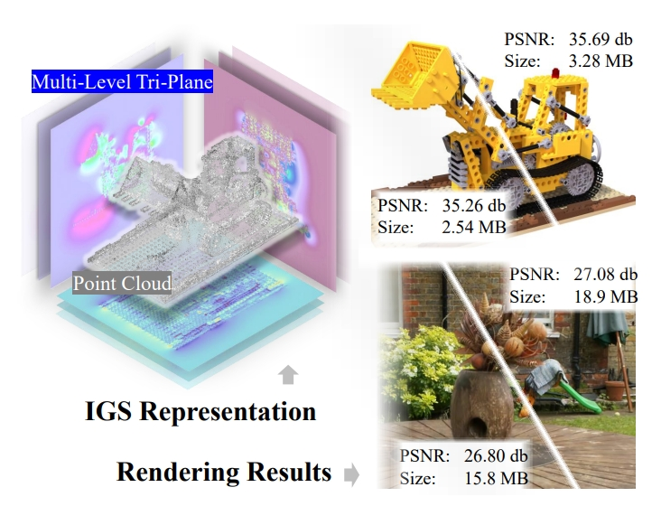

# Implicit Gaussian Splatting with Efficient Multi-Level Tri-Plane Representation

Minye Wu, Tinne Tuytelaars<br>
| [Webpage](https://wuminye.github.io/projects/IGS/) | [Full Paper](https://arxiv.org/pdf/2408.10041) |<br>
[Pre-trained Models (uploading) ]() <br>


<div style="text-align: center;">

</div>


This repository contains the official authors implementation associated with the paper "Implicit Gaussian Splatting with Efficient Multi-Level Tri-Plane Representation". We further provide the pre-trained uncompressed models used to create the error metrics reported in the paper.

Abstract: *Recent advancements in photo-realistic novel view synthesis have been significantly driven by Gaussian Splatting (3DGS). Nevertheless, the explicit nature of 3DGS data entails considerable storage requirements, highlighting a pressing need for more efficient data representations. To address this, we present Implicit Gaussian Splatting (IGS), an innovative hybrid model that integrates explicit point clouds with implicit feature embeddings through a multi-level tri-plane architecture. This architecture features 2D feature grids at various resolutions across different levels, facilitating continuous spatial domain representation and enhancing spatial correlations among Gaussian primitives. Building upon this foundation, we introduce a level-based progressive training scheme, which incorporates explicit spatial regularization. This method capitalizes on spatial correlations to enhance both the rendering quality and the compactness of the IGS representation. Furthermore, we propose a novel compression pipeline tailored for both point clouds and 2D feature grids, considering the entropy variations across different levels. Extensive experimental evaluations demonstrate that our algorithm can deliver high-quality rendering using only a few MBs, effectively balancing storage efficiency and rendering fidelity, and yielding results that are competitive with the state-of-the-art.*

## Cloning the Repository

```shell
# HTTPS
git clone https://github.com/wuminye/ImplicitGS.git
```

## Overview

The IGS shares a similar codebase as [3DGS](https://github.com/graphdeco-inria/gaussian-splatting), but without  viewer supports.  It includes a modified version of the diff-Gaussian rasterization module to enable visibility checks and uses Wandb for result logging.

The system environment we used is:

```
pytorch 2.0.1 + cuda 11.8 + python 3.9.18
```

### Setup (Linux)

#### Local Setup

Our default, provided install method is based on Conda package and environment management:

```shell
conda env create --file environment.yml
conda activate implicit_gs
```

### Running

To run the training, simply use the provided scripts. **Please remember to modify the dataset and logging folder paths in the scripts.**

```shell
# Synthetic_NeRF Dataset
sh train_synthetic_nerf.sh

# MipNeRF Dataset
sh train_mipnerf.sh

# DeepBlending and T&T Dataset
sh train_db_and_tt.sh
```

<details>
<summary><span style="font-weight: bold;">Primary Command Line Arguments for Training</span></summary>

  ####  -m
  Path to trained model.
  ####  -s
  Path to source dataset.
  #### --num_channels
  The number of channels for each feature planes.
  #### --plane_size
  The feature plane resolution for the largest one.
  #### --contractor
  Enable unbounded scene reconstruction.

  #### --bbox_scale
  The size scale of the bounding box. (>0)

</details>
<br>

The MipNeRF360 scenes are hosted by the paper authors [here](https://jonbarron.info/mipnerf360/). You can find our SfM data sets for Tanks&Temples and Deep Blending [here](https://repo-sam.inria.fr/fungraph/3d-gaussian-splatting/datasets/input/tandt_db.zip).

### Evaluation

We provide scripts to evaluate models under two different compression levels: 'low' and 'high'. **Please remember to modify  model folder paths in the scripts.**

```shell
# Synthetic_NeRF Dataset
sh test_nerf.sh

# MipNeRF Dataset
sh test_mipnerf.sh

# DeepBlending and T&T Dataset
sh test_db_and_tt.sh
```

If you want to evaluate our [pre-trained models(uploading)](), you will have to download the corresponding source data sets and indicate their location to ```distortion_curve.py``` with an additional ```-s``` flag in the scripts.

<details>
<summary><span style="font-weight: bold;">Primary Command Line Arguments for distortion_curve.py</span></summary>

  ####  -m
  Path to trained model.
  ####  -s
  Argument to override model's path to source dataset.
  #### --raw_points
  Using raw half-precision points in compression. 
</details>
<br>
